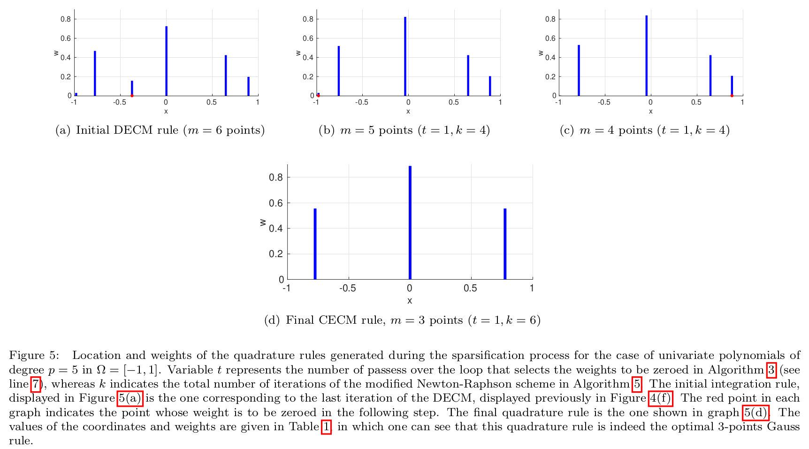

# Contents
This folder contains the source code of the Matlab functions required to use the **Continuous Empirical Cubature Method**, as well as the functions for the **Sequential Randomized Singular Value Decomposition** from [this paper](https://www.sciencedirect.com/science/article/pii/S004578252300676X) . It also contains the scripts for launching some of the examples shown in the paper.

# Example 1
## Univariate polynomials (section 6.1)

To determine the quadrature rule in the problem whose results are displayed in both Figure 4 and Figure 5(see below), launch script [EXAMPLES_1D/CECM_1D.m](EXAMPLES_1D/CECM_1D.m)




# Example 2
## Multivariate polynomials 2D (section 6.2)

To determine the quadrature rule in the problem whose results are displayed in both Figure 4 and Figure 5(see below), launch script [EXAMPLES_2D/CECM_2D.m](EXAMPLES_2D/CECM_2D.m)


# Example 3
## Multivariate polynomials 3D (section 6.2)
To determine the cubature rule in the problem whose results are displayed in Figure 6 (see below), launch script: [EXAMPLES_3D/CECM_3D.m](EXAMPLES_3D/CECM_3D.m)


# Example 4
## Sequential Randomized Singular Value Decompositions

Determine SVD of the snapshot matrix obtained by sampling the function shown in section 6.3: (see below)


To compare the performance of both the standard SVD and the proposed SRSVD, launch script: [EXAMPLE_partSVD/TestSeqSVD.m](EXAMPLE_partSVD/TestSeqSVD.m)

The size of the resulting snapshot matrix is determined by the variable:

```
SIZE_SNAPSHOT_MATRIX_IN_GBYTES = 2;
```

To enable the SRSVD, set

```
UsePartitionedRandomizedAlgorithm =1;
```

and specify the number of partitions by the following variable:

```
NUMBER_ROW_MATRICES_PARTITION =8 ;
```

If the entire matrix does not fit into memory, each block may be saved into
hard memory. This is controlled by the variable:

```
LimitGbytesMatricesSnapshots = 2 ;
```


# Citation
If this repo has been useful for you, please consider citing us as

```
@article{HERNANDEZ2024116552,
title = {CECM: A continuous empirical cubature method with application to the dimensional hyperreduction of parameterized finite element models},
journal = {Computer Methods in Applied Mechanics and Engineering},
volume = {418},
pages = {116552},
year = {2024},
issn = {0045-7825},
doi = {https://doi.org/10.1016/j.cma.2023.116552},
url = {https://www.sciencedirect.com/science/article/pii/S004578252300676X},
author = {J.A. Hernández and J.R. Bravo and S. {Ares de Parga}},
keywords = {Empirical Cubature Method, Hyperreduction, Reduced-order modeling, Singular Value Decomposition, Quadrature}
}
```


